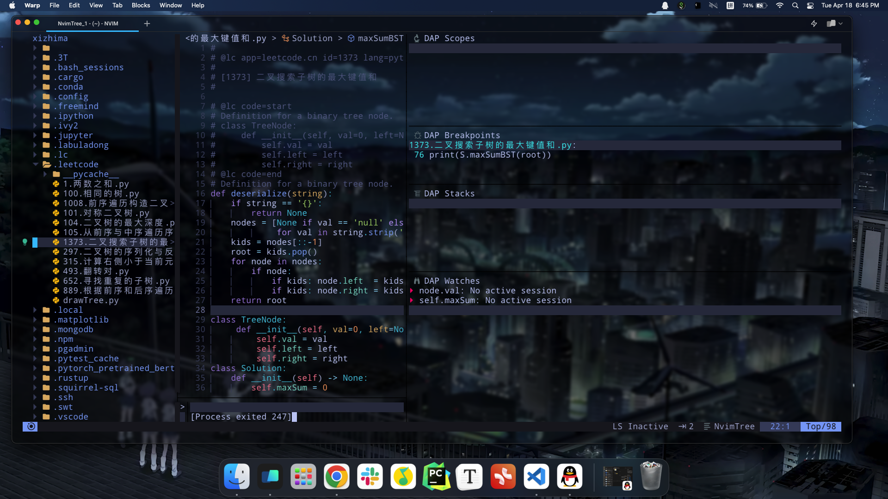

# Folder lvim
The folder lvim is something cloned from other repos by the install commands of lvim and since can't be upload to my repo. I can delete the git file and upload butumm, I need the git incase I need to get the update of the software to solve some bugs, So I can upload the file to a webdrive. 

(But then I didn't do it, for the lvim is still kind of premeture to me and it is more of a toy rather than a tool. I'll stick with vscode for some time.)

# Requirements
Install lunarvim
In lunarvim's github, there is a project called starter.lvim, I use the configuration there to make python debugger run
# Location of software
It's install by official website command not brew, it's installed on ~/.local/share/lunarvim, the configuration file is in ~/.config/lvim
# Features
## write file
1. autosave
2. persistent undo
3. indent/ unindent < and >
4. comment/ uncomment gc
## cheat sheet
1. cw: delete a word and enter insert mode
2. e: to the end of the word, b: to the back of the word 
## 我的感受
lua不知道是什么鸟语，真的难学，config很复杂，不过还好最后功能很全面。
